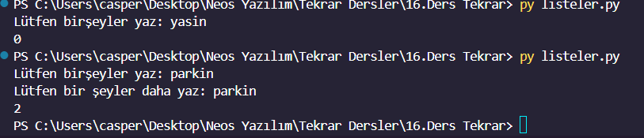

<h1>Function And Lists Examples Python</h1>
<h3>Python List, Tuple, Set, and Dictionary Operations</h3>

These Python codes include basic operations on lists, tuples, sets, and dictionaries. The code examples demonstrate addition, removal, sorting, conversion, and other operations on these data structures.

<h3>Features</h3>

List Operations: Operations such as appending an item to the end of the list, removing an item, inserting an item at a specific position, sorting, and reversing are performed.

Tuple Operations: Operations like conversion of tuples, adding items are done.

Set Operations: Operations between sets such as union, intersection, difference, symmetric difference are performed.

Dictionary Operations: Operations like adding an item, removing an item, nested dictionary usage are done.

